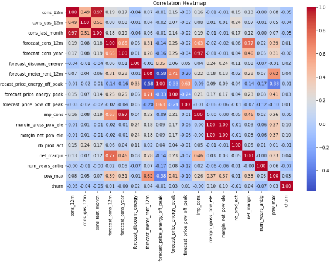

# PowerCo Churn Analysis

## Project Overview
This repository contains the work conducted for PowerCo, a major energy utility, to analyze and predict SME customer churn. The goal was to identify key churn drivers, develop a predictive model, and provide actionable recommendations to reduce churn and improve customer retention.

## Key Findings
- The predictive Random Forest model achieved **82% accuracy** in identifying customers likely to churn.
- Key factors influencing churn include:
  - **Net Margin per Consumption**
  - **Price Difference (December vs. January)**
  - **Yearly Consumption**
- A **20% targeted discount strategy** for high-risk, high-value customers could reduce churn by **10%**, potentially saving **$10 million annually**.

## Repository Structure
```
PowerCo_Churn_Analysis/
├── assets/
│   ├──  correlation_heatmap.png
│   ├──  Feature Importance.PNG
│   ├──  Churn Risk Distribution.PNG
│   ├── Key Customer Segments.PNG
│   ├──  Price Sensitivity Analysis.PNG
├── datasets/
│   ├── client_data .csv            # Initial dataset provided by PowerCo
│   ├── clean_data_after_eda.csv       # Cleaned dataset after exploratory analysis
│   ├── data_for_predictions.csv       # Final dataset used for modeling
├── documents/
│   ├── Hypothesis Formulation and Testing BCG.docx  # Hypothesis formulation document
│   ├── Data Description  # Data Variables Description
├── notebooks/
│   ├── PowerCo_Churn_Prediction.ipynb     # Notebook for analysis and modeling
│   ├── PowerCo_Feature_Engineering.ipynb  # Notebook for featured engineering
├── presentations/
│   ├── Executive Summary.pptx        # PowerPoint version of the executive summary
├── README.md                         # Project overview and instructions
├── requirements.txt
```

## How to Run the Project
1. **Clone this repository**:
   ```bash
   git clone https://github.com/Gordon-Mensah/PowerCo_Churn_Analysis.git
   cd PowerCo_Churn_Analysis
   ```

2. **Install dependencies**:
   Create a Python virtual environment and install the necessary libraries:
   ```bash
   pip install -r requirements.txt
   ```

3. **Run the notebooks**:
   Open the Jupyter Notebooks in your environment to reproduce the analysis:
   - `notebooks/PowerCo_Churn_Prediction.ipynb`
   - `notebooks/PowerCo_Feature_Engineering.ipynb`

4. **Explore the findings**:
   Review the datasets, documents, and presentations for insights and recommendations.

## Sample Outputs
### Correlation Heatmap
This heatmap highlights the relationships between features and their correlation with churn.


### Feature Importance
A visualization of the most important features driving churn predictions.


### Churn Risk Distribution
This distribution plot shows the predicted probability of churn for all customers.


### Key Customer Segments
Segmented data showing churn rates across different customer categories.


### Price Sensitivity Analysis
Analysis of how price changes influence churn rates.


## Skills Demonstrated
- **Data Analysis**: Conducted exploratory data analysis to understand customer trends.
- **Feature Engineering**: Created meaningful features to improve model performance.
- **Predictive Modeling**: Built and evaluated a Random Forest model to predict churn.
- **Communication**: Developed an executive summary and presentation for stakeholders.

## Key Technologies
- **Python**: For data analysis, feature engineering, and modeling.
- **Pandas & NumPy**: For data manipulation and analysis.
- **Scikit-learn**: For machine learning modeling and evaluation.
- **Matplotlib & Seaborn**: For data visualization.

## Future Work
- Implement a pilot program to test the retention strategy in a real-world setting.
- Refine the model with additional data to improve accuracy and robustness.
- Explore cost-benefit analysis for retention strategies.

---

### Author
# John Jerry Gordon-Mensah
This repository was developed as part of a job simulation for BCG X. Feel free to reach out for any questions or collaboration opportunities.

---

### License
This project is licensed under the MIT License. See the `LICENSE` file for details.

